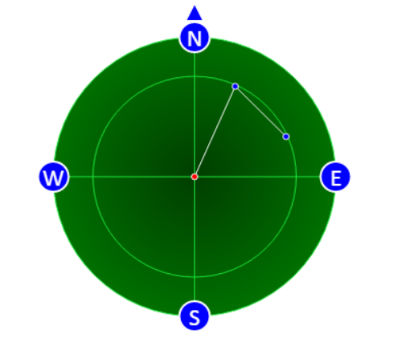

<h1> Simple Radar component</h1>

<p>You can create the radar using this sample code</p>

```javascript
        var radarComponent = new RadarComponent({
            el: document.getElementById('radar-view'),
            circleRadiusStep: 100, //difference between each two neighbours circles is 100m
            stepFactor: 100, //each 100m means 100px
            animateFrames: 10,
            animate_period: 50, //50ms per frame
            points: points,
            northAngle: 0, //in degrees
            pointRadius: 3,

            enable_blink: false,
            blink_period: 500

        });
		
	radarComponent.draw();

	// you can update coorinates by using 
	radarComponent.move({x : 10, y : 10});

	// rotate comp by angele in degrees
	radarComponent.rotate(60);
```

<p>Screenshot</p>



